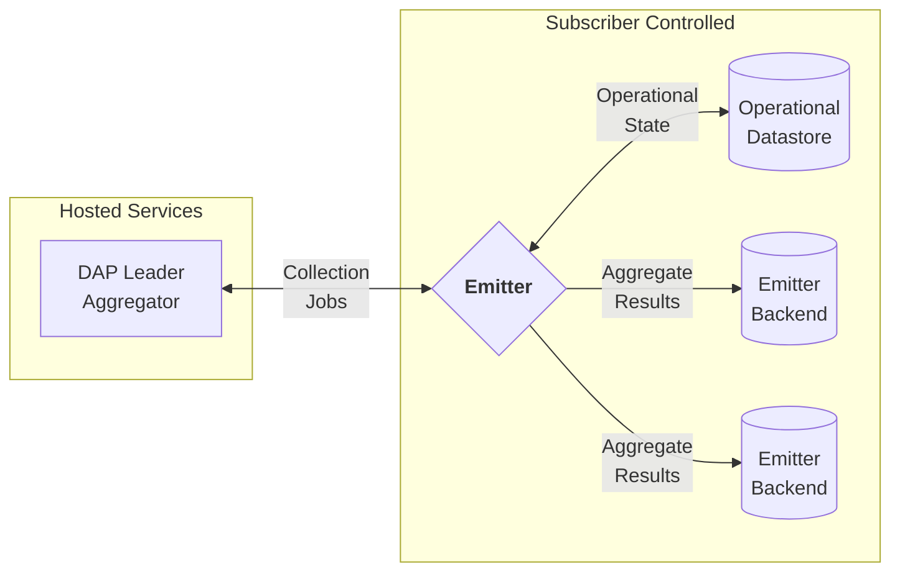

This comment describes an emitter, which is the general form of a stateful DAP collector.

<!--toc:start-->
- [Design Goals](#design-goals)
- [Deployment](#deployment)
- [Configuration](#configuration)
- [Jobs](#jobs)
  - [Job Types](#job-types)
    - [DiscoverTasks](#discovertasks)
    - [CreatePrio3Collection](#createprio3collection)
    - [PollPrio3Collection](#pollprio3collection)
    - [EmitPrio3Collection](#emitprio3collection)
  - [Other Query Types](#other-query-types)
- [Datastores](#datastores)
  - [Operational Datastore](#operational-datastore)
  - [Emitter Backend](#emitter-backend)
    - [`SqlEmitterBackend` Usage](#sqlemitterbackend-usage)
- [Handling Different DAP Versions](#handling-different-dap-versions)
- [Aggregation Parameter](#aggregation-parameter)
- [Prefix tree VDAFs](#prefix-tree-vdafs)
<!--toc:end-->

An emitter reliably manages many collection jobs to yield aggregate results, then sends the aggregate results to some other standard, durable storage.

Two implementations of emitter are proposed.
- Janus Emitter: A collector that is DAP implementation agnostic to the maximum extent possible, similar to the existing `janus_client` and `janus_collector` Rust crates. It largely serves as a reference implementation for a stateful DAP collector.
- Divvi Up Emitter: A collector that builds on the Janus Emitter. It incorporates Divvi Up features into it, such as querying the Divvi Up API to discover new tasks.

Common functionality is factored out into a library crate in Janus, which both implementations rely on.

## Design Goals

Minimum functional requirements:
- Given a set of DAP tasks, it automatically manages the collection process.
- Sends aggregate results to another versatile storage backend, such as a SQL database or Prometheus. If desired, the storage backend can be shared with the operational datastore.
- Initial implementations support the fixed size query type, and the Prio3 suite of VDAFs.

Minimum non-functional requirements:
- At least as fault tolerant as its underlying datastore--data loss must not occur if the process is interrupted or crashes. Data loss in this context means loss of the collection job ID, and by extension the aggregate result and the reports that constitute the aggregate result.
- An arbitrary number of emitter processes should be able to run on the same datastore.
- The largest deployments should be able to handle at least a thousand tasks.
- Easy for subscribers to deploy. It should fit well into a Janus BYOH deployment.

QUESTION: Any other non-functional requirements to be conscious of?

## Deployment

A standard emitter deployment roughly follows this topology:


Emitter backends are robust datastores that may or may not already be part of a subscriber's data pipeline. Initial backend support is for a SQL database. It is possible to use the operational datastore as the emitter backend, to ease deployment complexity.

The emitter is a single process, which can be orchestrated by any standard process management tool, e.g. Kubernetes, systemd, Nomad. All persistent state is stored in the operational database.

It is safe to run multiple emitter processes sharing the same operational datastore, allowing HA and scaling.

Subscribers should not operate multiple emitters for a single DAP task. This would result in non-deterministic splitting of results between the two emitters.

## Configuration

Configuration is YAML-based, in similar vein to the configuration files used by Janus.

The config schema is roughly like so:
```yaml
# config.yaml

# Same as Janus.
database:
  url: postgres://postgres@127.0.0.1:5432/postgres
health_check_listen_address: 0.0.0.0:8003
logging_config:
  # ...
metrics_config:
  # ...

# Emitter-specific configuration
task_discovery_interval_secs: 60
emitters:
  # Name is mainly used to associate secret-containing environment variables.
  - name: sql-1
    sql:
      url: postgres://postgres@127.0.0.1:5432/aggregate_results
  - name: amqp-1
    amqp:
      url: amqps://amqp@127.0.0.1:10000/vhost
```

For Divvi Up Emitters, `config.yaml` is extended with account details:
```yaml
divviup_api_url: https://api.divviup.org
divviup_account_id: abcd1234
```

For Janus Emitters, a `tasks.yaml` file is required:
```yaml
- task_id: "aaaaaaaaaaaaaaaaaaaaaaaaaaaaaaaaaaaaaaaaaaa"
  leader: "https://example.com/"
  query_type: !FixedSize
    schedule: "0 * * * *" # Every hour at minute 0.
  vdaf: !Prio3Sum
    bits: 16
  time_precision: 1800
  collector_credential: foo

- task_id: "bbbbbbbbbbbbbbbbbbbbbbbbbbbbbbbbbbbbbbbbbbb"
  leader: "https://example.com/"
  query_type: !FixedSize
    schedule: "0 1 * * 1" # 01:00 on Monday.
  vdaf: !Prio3Count
  time_precision: 1800
  collector_credential: bar
```

Notice that fixed-size tasks contain a schedule following a `cron` expression.
This dictates the interval in which fixed-size queries are polled.

`tasks.yaml` can be modified at runtime and will automatically be refreshed.

Secrets are configurable through environment variables. For example:
```
EMITTER_DATABASE_PASSWORD=password
EMITTER_SQL_PASSWORD_sql-1=password
EMITTER_AMQP_PASSWORD_amqp-1=password
EMITTER_COLLECTOR_CREDENTIAL_foo='{json body}' 
EMITTER_COLLECTOR_CREDENTIAL_bar='{json body}' 
EMITTER_DIVVIUP_API_TOKEN=token
```

PROBLEM: If providing secrets through environment variable it becomes cumbersome to introduce new collector credentials.

PROBLEM: The Divvi Up API does not provide any notion of a collection schedule. This might be a necessary addition--it is conceivable that all tasks for a given subscriber won't fit a one-size-fits-all schedule.

## Jobs

An emitter is an asynchronous scheduled job processing server. Emitter processes poll for outstanding jobs, then drive them to completion. Jobs are idempotent, retryable, and interruptible, unless otherwise indicated.

Note the default HTTP retry logic of `janus_collector` is not used. If an upstream server fails with a retryable error, the job is rescheduled instead for some time in the future, following exponential backoff. This avoids keeping database transactions open or tying up a worker for too long.

### Job Types

TODO(inahga): Perhaps the job sequence is best presented as a diagram?

#### DiscoverTasks

Invoke an implementation defined callback function which returns the list of relevant tasks from some source of truth. Reconcile the internal task table against this list.
For each newly discovered task, schedule a `CreatePrio3Collection` job according to the task's schedule.

For a Janus Emitter, the source of truth is a configuration file. For a Divvi Up Emitter, the source of truth is the Divvi Up API.

Unsupported tasks are ignored.

#### CreatePrio3Collection

`CreatePrio3Collection` jobs are generated with a random collection job ID. This ID is persisted to the queue before the following request is sent.

Issue a `PUT /tasks/{task_id}/collection_jobs/{collection_job_id}` to the DAP leader. For fixed size queries, query for the current batch.

If the response is OK, schedule a `PollPrio3Collection` job for immediate completion. If the response is a non-retryable error (i.e. there are insufficient reports to satisfy the query), schedule a new `CreatePrio3Collection` job for the future.

#### PollPrio3Collection

Poll a collection once. If the collection is ready, create an `EmitPrio3Collection` job for immediate completion for each configured [`EmitterBackend`](#emitter-backend). For fixed size queries, schedule another `CreatePrio3Collection` job for immediate completion.

If the collection is not ready or the request fails with a retryable error, schedule another `PollPrio3Collection` job following exponential backoff.

NOTE: Ideally we would eagerly create collection jobs until all outstanding reports are associated with a batch, then poll each collection job individually. Thus, the responsibility of scheduling the next collection job falls onto `CreatePrio3Collection` or some other job scheduling job. However, we cannot do this because Janus can associate a collection job with a batch that is undergoing collection. That batch will not become unavailable for a new collection job until it is first polled. Thus we cannot eagerly create collection jobs. [This wil change in the next draft of DAP](https://github.com/ietf-wg-ppm/draft-ietf-ppm-dap/issues/526).

#### EmitPrio3Collection

Emit a collection to the configured [`EmitterBackend`]. If this fails with a retryable error, reschedule another `EmitPrio3Collection` job following exponential backoff.

### Other Query Types

For time-interval, changes would consist of:
1. Job scheduling: jobs would be scheduled on some multiple of the task's time precision, offset by some user-configurable delay to account for long-tail reports.
1. Job state: the query would be on the interval `[last_successful_interval, next_interval)`.
1. Functionality for backfilling a time-interval task once it has been discovered. It is possible that a task has been receiving reports for a long time before it is discovered or the emitter is adopted.

QUESTION: Anything else I'm missing?

For time-bucketed fixed-size, no changes are necessary. It is left to the user to combine aggregates for overlapping intervals.

## Datastores

### Operational Datastore

An emitter must have the same operational datastore support as a Janus aggregator helper, to allow sharing of the datastore instance for subscribers using Bring-Your-Own-Helper (BYOH). At the time of this writing, this is PostgreSQL 15.

The following state is stored:
- A job queue. Note that collection job state is carried forward through job state.
- A set of known tasks.

SQLite support is considered a "nice to have". It is not targeted for initial implementation, but the code/interfaces should be written such that SQLite is an almost-drop-in replacement.

The emitter is well suited for use of an ORM. The set of SQL operations is small, the performance characteristics are lighter than Janus, and we desire portability of databases. We will use SeaORM as the ORM, the ORM used in `divviup-api`.

NOTE: I haven't found any widely accepted job queue library for Rust+PostgreSQL. Indeed, we roll our own for both Janus and divviup-api. We can largely crib the [queue implementation](https://github.com/divviup/divviup-api/blob/main/src/queue.rs) used in `divviup-api`.

### Emitter Backend

An `EmitterBackend` is the destination for aggregate results. It roughly follows this interface:
```rust
/// It's necessary for this to be generic over T because we may want to support VDAFs where the
/// aggregate result is not actually the desired output. For instance, Poplar1 prefix tree levels
/// are not very interesting to emit--we may want to perform some function over the complete tree
/// before emitting results.
#[async_trait]
pub trait EmitterBackend<T, Q: QueryType> {
    async fn emit(&self, collection: Collection<T, Q>) -> Result<(), Error>;
}
```

Each aggregate result will be supplied to the `emit()` method.

We expect the most versatile implementation will be `SqlEmitterBackend`, which at minimum supports the same SQL databases that are used for operational state. It roughly follows this form.
```rust
struct SqlEmitterBackend { 
    /* connection parameters, table name, etc. */
}

/// Implementation for the aggregate result of Prio3Count. Ideally we would be able to use the
/// associated type `<Prio3Count as Vdaf>::AggregateResult` instead of raw `u64`, but there
/// appears to be a compiler bug when impl'ing with associated types.
/// https://github.com/rust-lang/rust/issues/99940
impl EmitterBackend<u64, FixedSize> for SqlEmitterBackend {
    async fn emit(&self, collection: Collection<u64, FixedSize> -> Result<(), Error> {
        /* append the aggregate result to the desired table */
    }
}
```
For each received aggregate result, it writes a row to a target table. See [`SqlEmitterBackend` Usage](#sqlemitterbackend-usage) for details.

Each EmitterBackend places soft constraints on the proper usage of the resulting data, and dictates its own API stability guidelines. The `EmitterBackend` interface should be versatile enough to fit other storage backends, including but not limited to Prometheus (OpenTelemetry), AMQP-compatible services, data warehouses such as BigQuery, AWS S3, and perhaps even file/`stdout`.

An emitter can emit to multiple backends.

#### `SqlEmitterBackend` Usage

TODO(inahga): This schema is not so great. I think it would be more useful to have separate tables for each VDAF which FK into a main `aggregate_results` table. Need to iterate more.

The `SqlEmitterBackend` manages an additional schema that is roughly like so:
```sql
-- Note: schema is incomplete, some fields are omitted for brevity.

CREATE TABLE internal_prio3_aggregate_results (
    task_id          BYTEA UNIQUE NOT NULL,
    aggregate_result []BIGINT NOT NULL, -- Scalar results (count, sum) are a 1-sized array,
                                        -- vectors (histogram, sumvec) are n-sized arrays.
                                        -- TODO(inahga): bigint isn't big enough--non-count VDAFs
                                        -- are u128.
    interval         TSRANGE NOT NULL,
    created_at       TIMESTAMP NOT NULL,
);

CREATE VIEW prio3_aggregate_results_v1 AS 
    SELECT task_id, aggregate_result, interval, created_at
    FROM internal_aggregate_results;
```

A separate database should be dedicated to aggregate results, but the database instance may be shared with the operational database.

The schema of `internal_prio3_aggregate_results` is an implementation detail and may change arbitrarily between releases. Users must not rely on the schema of any internal tables.

The supported and stable API boundary is the `prio3_aggregate_results_v1` view. Users may query this view to retrieve results at will.

The returned columns of a versioned view are guaranteed to never change, even if the `internal_prio3_aggregate_results` table changes. The definition of the view may change arbitrarily between releases. If new columns are necessary, they will be introduced as `prio3_aggregate_results_v2`, thus preserving the functionality of any existing queries or programs. Users may migrate to `prio3_aggregate_results_v2` at will.

An additional `SqlGarbageCollection` job may be configured and run periodically to prune old results.

NOTE: We could make `prio3_aggregate_results_v1` a materialized view. This has better performance characteristics in exchange needing management of `REFRESH MATERIALIZED VIEW`. It also lets users create arbitrary indices against the view. Materialized views are supported in PostgreSQL but not SQLite.

NOTE: The background of this design choice is that we will run into similar design problems with having CSV export. We would require some persistent SQL storage of aggregate results, and expose some API boundary to query them. The API boundary may be subject to feature requests, e.g. filter by date, filter by task ID, join against task metadata--which are best suited as SQL operations. We would also have similar problems around API boundary stability (i.e. needing a versioned CSV export API). We can cut out the middle man and allow maximum user flexibility by directly exposing a SQL interface, with some boundaries around what views are safe to use. If we desire the simplicity of a CSV export endpoint, we could expose a trivial `/dump` endpoint which is a CSV export of the table as-is.

## Handling Different DAP Versions

The Janus emitter follows the same DAP versioning strategy currently in Janus. That is, a single instance of the emitter will not support multiple DAP versions.

QUESTION: Should the Divvi Up Emitter support multiple DAP versions? This could get really nasty and complex...

## Aggregation Parameter

The Emitter will always assume the aggregation parameter is `()`, which is true for Prio3.

See [Prefix tree VDAFs](#prefix-tree-vdafs) for more discussion.

## Prefix tree VDAFs

NOTE: Most of this section is not relevant for the minimal implementation of an emitter, but I think at least some discussion is justified to avoid painting ourselves into a corner when it comes time for implementing Poplar1.

Collection for Poplar1 (and Mastic) first involves collection of all levels of a prefix tree, then evaluating some function based on the complete prefix tree. The known useful functions are heavy hitters and quantiles.

Given a VDAF construction of `N` bits, `N` collections must be made to fully construct the prefix tree for any given batch. Collection jobs for a given batch must be executed sequentially, with the aggregation parameter being the set of candidate prefixes of interest, determined by the last aggregate result.

I think further design on this is gated by the following questions:

QUESTION: What is the desired result of a Poplar1 collection? Options:
1. Just emit each level of the prefix tree (i.e. pretty much do nothing and leave it to the user to construct the prefix tree).
1. Emit the complete prefix tree, without evaluating any function. Leave it to the user to execute functions on the tree.
1. Evaluate some function on the prefix tree, such as heavy hitters or quantiles, and emit the results.

QUESTION: What other functions of the prefix tree could be useful, besides heavy hitters and quantiles? Could we adopt both options 2 and 3, where we expose the convenient functions but also optionally leave it to the user to create their own functions over the prefix tree?
