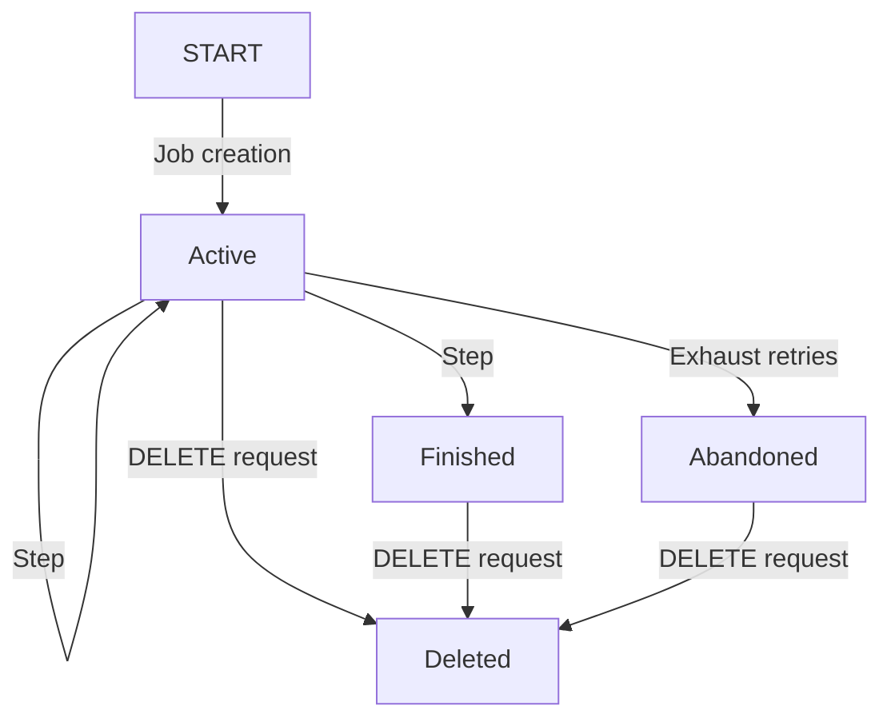
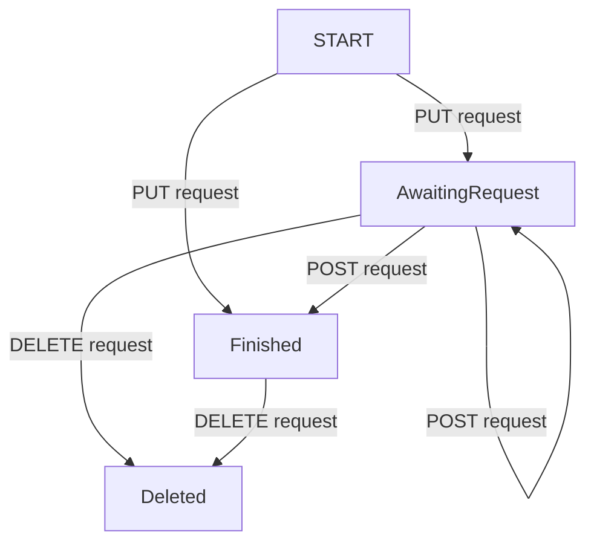
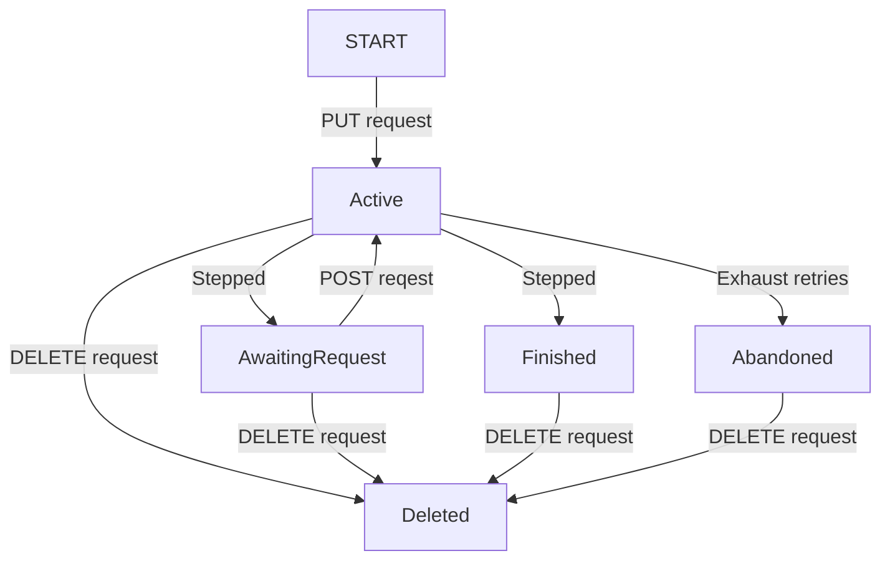
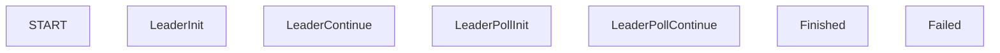
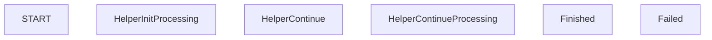

# Data Model

This document describes the data model used by Janus, in terms of data flow and
interaction between the various system componeents. The database schema used by
Janus is stored in the `db/` directory of the repository; this document will
refer to it as necessary.

## Leader

### Report upload

Uploaded reports are stored to the `client_reports` table.

### Aggregation job creation

The aggregation job creator reads reports which are unaggregated (i.e. their
`aggregation_started` column is false), groups them into aggregation jobs, and
writes those aggregation jobs to the `aggregation_jobs` and
`report_aggregations` tables. (The `report_aggregations` table stores per-report
data, while the `aggregation_jobs` table stores per-aggregation-job data.)

Report aggregations are generally written in the `LeaderInit` state, and aggregation
jobs are initially written in the `Active` state. If a report happens to
fall into a batch that is already collected (due to the related
`batch_aggregations` being in state `Collected` or `Scrubbed`), it will instead
be written in the `Failed` state with `BatchCollected` as the reason. If all
report aggregations fail in this way, the aggregation job will be written in the
`Finished` state.

The process of writing a new non-`Finished` aggregation job will also increase
the `aggregation_jobs_created` counter for a shard of the batch aggregations
associated with the aggregation job.

Any reports which are included in an aggregation job are scrubbed, which means
that the report data included in the `client_reports` table is removed. The
`client_reports` row itself remains & is used to detect duplicated uploads.

### Aggregation job stepping

The aggregation job driver steps aggregation jobs. Only `Active` aggregation
jobs are stepped.

Stepping an aggregation job updates the report aggregations with the stepped
values, based on the VDAF computations coordinated with the Helper. Any report
aggregations which have reached a `Finished` state also update a batch
aggregation shard to include the resulting output share. Report aggregations may
also move to a `Failed` state if stepping the report aggregation fails.

If all report aggregations have reached a terminal (`Finished` or `Failed`)
state, the aggregation job will move to a `Finished` state. This will update a
shard of the relevant batch aggregations to increment their
`aggregation_jobs_terminated` counters.

### Collection job creation

Received collection jobs are written to the `collection_jobs` table. Collection
jobs will initially be in the `Start` state.

### Collection job stepping

The collection job driver steps collection jobs. Only collection jobs in the
`Start` or `Poll` state are stepped.

A stepped collection job will not move forward until the relevant batch
aggregations' `aggregation_jobs_created` & `aggregation_jobs_terminated`
counters match (i.e. all aggregation jobs associated with the relevant batches
have terminated) and there are no outstanding unaggregated client reports. Until
that happens, the job will be released once again and left in the `Start` state.

Once the collection job is ready to move forward, all relevant batch aggregation
shards will be updated to the `Collected` state, to stop any possibility of
additional aggregations into these batches. (Even batch aggregation shards which
have not yet been written will have an empty batch aggregation shard in the
`Collected` state be written.)

The collection job driver then computes its final aggregate share for the
collection job, and sends an aggregate share request to the Helper to retrieve
their encrypted aggregate share. If the helper returns its aggregate share
immediately, it will be stored in the collection job, to be retrieved by the
Collector. If the helper doesn't return its aggregate share immediately, then
the collection job will advance to the `Poll` state, and the collection job
driver will try fetching the aggregate share later. Once a collection job is
finished, all relevant batch aggregations are then scrubbed, which removes all
aggregation information from the batch aggregations.

## Helper

### Aggregation job stepping

The Helper receives aggregation jobs, including relevant report shares, from the
Leader.

Report shares are written as scrubbed reports, i.e. without report data. This is
because the relevant report data is stored with the report aggregations.

It writes aggregation jobs & report aggregations with state tracking similar
to that described in the Leader's aggregation job creation/aggregation job
stepping sections. Batch aggregations are also updated similarly to the Leader.

Depending on whether the task is configured with the synchronous or asynchronous
aggregation mode, VDAF processing will either be done while handling HTTP
requests from the leader or separately. If the synchronous mode is enabled,
aggregation jobs will start in the `AwaitingRequest` state or a terminal state,
and will either return to the `AwaitingRequest` state or transition to a
terminal state when handling each request from the Leader. If the asynchronous
mode is enabled, aggregation jobs will start in the `Active` state or a terminal
state, transition to the `AwaitingRequest` state or a terminal state after being
stepped, and transition to the `Active` state again after receiving the next
request from the Leader.

### Aggregate share requests

On receiving an aggregate share request, the Helper computes the aggregate share
from all relevant batch aggregation shards. These batch aggregation shards are
then scrubbed; like with the Leader, empty batch aggregation shards are written
for any currently-nonexistent shards to avoid the possibility of concurrent
aggregation.

# State Machines

## Aggregation Job

### Leader

### Helper, Synchronous Mode

### Helper, Asynchronous Mode

## Report Aggregation

### Leader

### Helper

